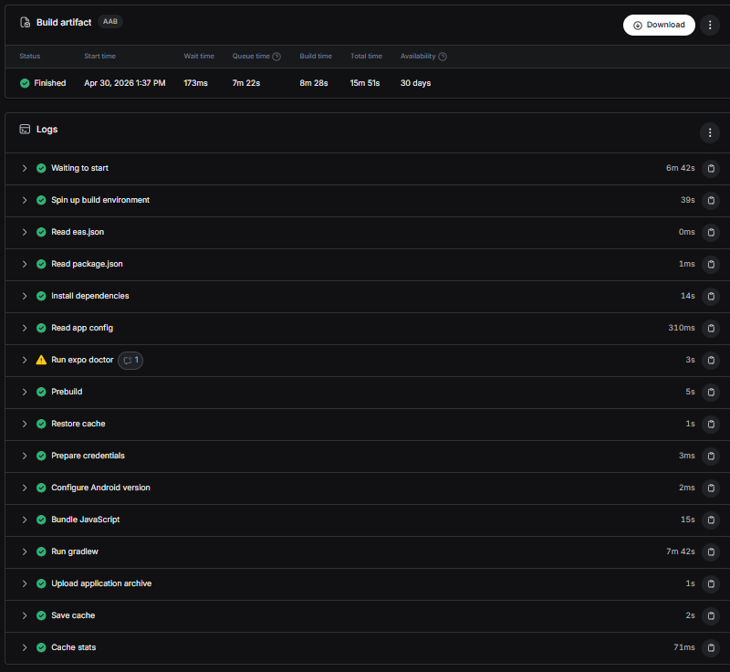

# Web Cloud Ynov — Livrable 1

Application React Native (Expo) avec authentification multi-méthodes via Firebase et déploiement continu sur GitHub Pages + EAS.

## 🚀 Application déployée

**Lien web :** [https://valentinsaraiva-mmi.github.io/web-cloud-ynov](https://valentinsaraiva-mmi.github.io/web-cloud-ynov)

## ✅ Fonctionnalités

### Architecture
- Expo Router avec navigation par onglets
- Pages : **Accueil**, **Connexion**, **Inscription**, **Profil**

### Authentification Firebase (5 méthodes)
- Email / Mot de passe
- Téléphone (OTP) avec reCAPTCHA visible
- GitHub (OAuth via popup)
- Facebook (OAuth via popup)
- Connexion anonyme

### Expérience utilisateur
- Validation en temps réel des formulaires (email, mot de passe fort, nom, numéro)
- Toaster animé sur succès / erreur
- Redirection automatique vers le profil après connexion ou inscription
- Redirection vers la connexion après déconnexion
- Bouton de déconnexion désactivé si aucun utilisateur n'est connecté

### CI/CD
- Workflow GitHub Actions qui :
  - Déploie automatiquement la version web sur GitHub Pages à chaque push sur `main`
  - Build l'application Android via EAS

## 🧪 Tester la connexion par téléphone

Un numéro de test est configuré dans Firebase pour permettre la validation sans envoyer de SMS réel :

| Numéro de téléphone   | Code de validation |
|------------------------|--------------------|
| `+33 6 42 42 42 42`    | `123456`           |

## 📸 Build EAS



## 🛠️ Lancer le projet en local

```bash
npm install
npx expo start
```

Puis sélectionner la cible (web, iOS, Android) dans la console Expo.

## 📦 Stack technique

- **Expo SDK 54** + Expo Router
- **React Native 0.81** + React 19
- **Firebase 12** (Auth)
- **TypeScript**
- **EAS Build** + **GitHub Actions** + **gh-pages**
